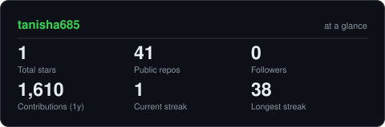
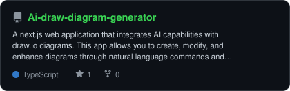
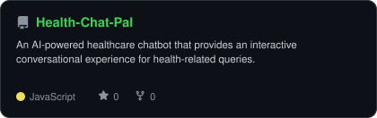
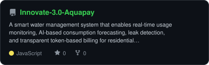

<!-- PORTRAIT - generated by scripts/dotify.py from assets/jacket.png.
     Colour mode, so one file serves both GitHub themes. Regenerate with:
       python scripts/dotify.py assets/jacket.png -o assets/portrait \
         --cols 100 --equalize --detail 0.5 --color -->

 

<!-- NAME / TAGLINE - animated typing -->

 

<!-- SOCIALS -->

---

## `~/` whoami

Hi, I'm **Tanisha Srivastava**. I build things at the intersection of **AI, software development, and the web**,

and I enjoy solving problems, learning new technologies, and turning ideas into things that actually work.

* 🚀Currently building **AI-powered applications** and **AI-Assisted Drug Discovery**
* 🤖Portfolio: **[tanisha-srivastava.netlify.app](https://tanisha-srivastava.netlify.app/)**
* 💻Learning **Advanced DSA + AI/ML + Full-Stack Development**
* 🧠Exploring **Generative AI, Machine Learning & Software Engineering**
* 🌐Practicing **Data Structures & Algorithms** and competitive programming
* 🏆Participated in the **Bharatiya Antariksh Hackathon — ISRO**
* 🔬Interested in **Open Source, Hackathons & building real-world projects**
* 🌱Fun fact: **I started coding because I wanted to build ideas that I couldn't find anywhere else.**

 

## `~/` toolbox

---

## `~/` skill radar

<table>
<tr>
<td width="50%" align="center" valign="middle">

<!-- Self-rated radar - edit assets/skills.json, the workflow redraws it -->
<picture>
  <source media="(prefers-color-scheme: dark)"  srcset="assets/radar-dark.svg">
  <source media="(prefers-color-scheme: light)" srcset="assets/radar-light.svg">
  
</picture>

</td>
<td width="50%" align="center" valign="middle">

<!-- Live radar built from real language byte counts across your repos -->
<picture>
  <source media="(prefers-color-scheme: dark)"  srcset="assets/radar-langs-dark.svg">
  <source media="(prefers-color-scheme: light)" srcset="assets/radar-langs-light.svg">
  
</picture>

</td>
</tr>
</table>

---

## `~/` contribution calendar

<!-- 3D isometric calendar, regenerated every 6h by .github/workflows/metrics.yml -->

  

<!-- Snake eats the contribution graph - .github/workflows/snake.yml -->
<picture>
  <source media="(prefers-color-scheme: dark)"  srcset="https://raw.githubusercontent.com/tanisha685/tanisha685/output/snake-dark.svg">
  <source media="(prefers-color-scheme: light)" srcset="https://raw.githubusercontent.com/tanisha685/tanisha685/output/snake.svg">
  
</picture>

---

## `~/` the numbers

<!-- Generated by scripts/cards.py into this repo. Deliberately NOT
     github-readme-stats / streak-stats / github-profile-trophy: those are
     shared public instances that go down and take the whole section with them. -->
<picture>
  <source media="(prefers-color-scheme: dark)"  srcset="assets/card-stats-dark.svg">
  <source media="(prefers-color-scheme: light)" srcset="assets/card-stats-light.svg">
  
</picture>

 

  

## 🏆 Achievements

<table>
<tr>
<td width="80">

🚀

</td>
<td>

### Bharatiya Antariksh Hackathon — ISRO

Selected among *34* teams from 15,104 submissions for the **national Grand Finale**.
 
Developed **BiSolar Guard**, a physics-informed AI framework for solar-flare nowcasting using
combined soft and hard X-ray observations from Aditya-L1 and GOES-16.

</td>
</tr>
</table>

---

## `~/` selected work

<!-- Cards generated by scripts/cards.py from assets/projects.json.
     Stars, forks and language are pulled live from the API on every run. -->
<table>
<tr>
<td width="50%">
  <a href="https://github.com/tanisha685/Ai-draw-diagram-generator">
    <picture>
      <source media="(prefers-color-scheme: dark)"  srcset="assets/card-Ai-draw-diagram-generator-dark.svg">
      <source media="(prefers-color-scheme: light)" srcset="assets/card-Ai-draw-diagram-generator-light.svg">
      
    </picture>
  </a>
</td>
<td width="50%">
  <a href="https://github.com/tanisha685/Health-Chat-Pal">
    <picture>
      <source media="(prefers-color-scheme: dark)"  srcset="assets/card-Health-Chat-Pal-dark.svg">
      <source media="(prefers-color-scheme: light)" srcset="assets/card-Health-Chat-Pal-light.svg">
      
    </picture>
  </a>
</td>
</tr>
<tr>
<td width="50%">
  <a href="https://github.com/tanisha685/AI-resume-analyzer">
    <picture>
      <source media="(prefers-color-scheme: dark)"  srcset="assets/card-AI-resume-analyzer-dark.svg">
      <source media="(prefers-color-scheme: light)" srcset="assets/card-AI-resume-analyzer-light.svg">
      
    </picture>
  </a>
</td>
<td width="50%">
  <a href="https://github.com/tanisha685/Innovate-3.0-Aquapay">
    <picture>
      <source media="(prefers-color-scheme: dark)"  srcset="assets/card-Innovate-3.0-Aquapay-dark.svg">
      <source media="(prefers-color-scheme: light)" srcset="assets/card-Innovate-3.0-Aquapay-light.svg">
      
    </picture>
  </a>
</td>
</tr>
</table>

| project | live | stack |
|---|---|---|
| **[ai-draw-io](https://github.com/tanisha685/Ai-draw-diagram-generator)** | [https://github.com/tanisha685/Ai-draw-diagram-generator](https://github.com/tanisha685/Ai-draw-diagram-generator) | `TypeScript` `JavaScript` |
| **[HealthChatPal](https://github.com/tanisha685/Health-Chat-Pal)** | [https://github.com/tanisha685/Health-Chat-Pal](https://github.com/tanisha685/Health-Chat-Pal) | `JavaScript` `Python` |
| **[AI-Resume-Analyzer](https://github.com/tanisha685/AI-resume-analyzer)** | [https://ai-resume-analyzer-and-career-recommendation-system.streamlit.app/](https://ai-resume-analyzer-and-career-recommendation-system.streamlit.app/) | `Python` `TypeScript` |
| **[AquaPay](https://github.com/tanisha685/Innovate-3.0-Aquapay)** | [https://github.com/tanisha685/Innovate-3.0-Aquapay](https://github.com/tanisha685/Innovate-3.0-Aquapay) | `JavaScript` `Python` |

---

`01110100 01101000 01100001 01101110 01101011 01110011 00100000 01100110 01101111 01110010 00100000 01110011 01100011 01110010 01101111 01101100 01101100 01101001 01101110 01100111`

